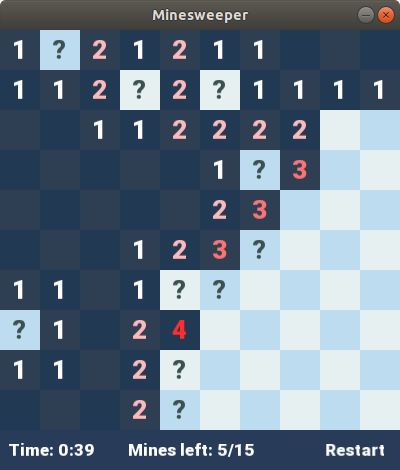
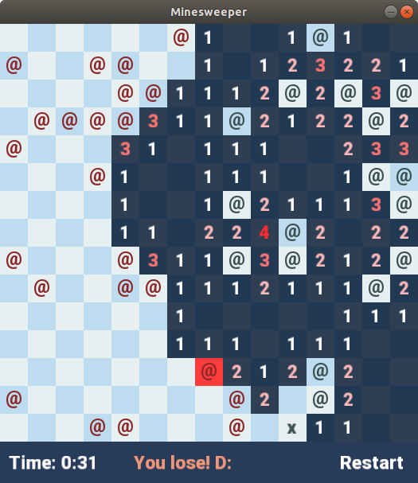

# Minesweeper

Implementation of [Minesweeper](https://en.wikipedia.org/wiki/Minesweeper_(video_game)).  
Dependency: [SFML](https://github.com/SFML/SFML)

### Features
- Configurable field through config.dat file (width, height, dimension, n° of mines);  
- "Safe space": first click always uncovers an empty area;  
- `?` symbol to flag dangerous cells (right click on covered cell);  
- Fast uncovering of neighboring cells (left click on uncovered cell);  
- Animation: smooth opening of spaces through BSF-like algorithm.  
